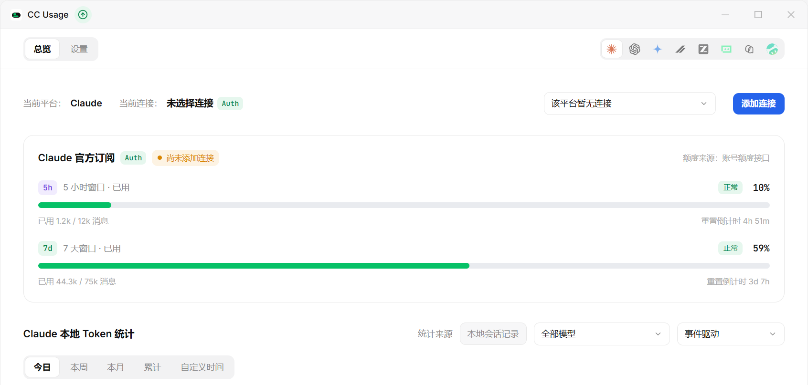
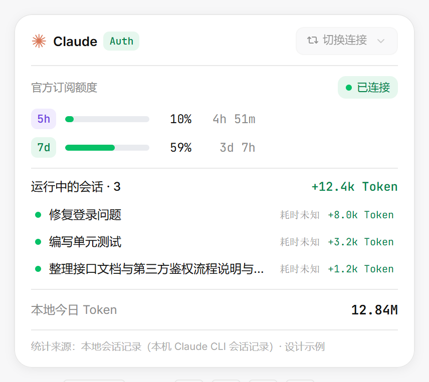

<div align="center">

# CC Usage

[](https://github.com/haishishushu/cc-usage/releases/latest)
[](https://github.com/haishishushu/cc-usage/blob/main/LICENSE)
[](https://github.com/haishishushu/cc-usage)
[](https://haishishushu.github.io/cc-usage-website/)

**A Dynamic-Island-style usage monitor for AI coding tools — live on your desktop.**

Track Claude Code, Codex and other AI coding assistants' subscription quota, token usage,
and request logs in one always-on-top panel. 100% local — no account, no upload.

[Download](https://haishishushu.github.io/cc-usage-website/#/download) · [Docs](https://haishishushu.github.io/cc-usage-website/#/docs) · [Changelog](https://github.com/haishishushu/cc-usage/releases)

[中文文档](./README.md) | English



</div>

## What is CC Usage?

CC Usage is an **open-source desktop usage tracker for AI coding tools**. A small
"Dynamic Island" capsule stays on your screen edge showing subscription quota in real time,
and a full dashboard gives you per-request cost, token breakdowns, and trend charts.

Think of it as the **desktop GUI companion to CLI counters like `ccusage`**: instead of
running a command every time you want to check your Claude Code or Codex usage, CC Usage
sits quietly in the corner of your screen and keeps score for you.

**Highlights**

- 🏝️ **Dynamic Island** — a capsule docked to any screen edge; double-click to expand into a detail card
- 📊 **Full dashboard** — today / week / month / all-time tokens, cache hit rate, request count, estimated cost
- 🔄 **Live quota windows** — 5-hour and 7-day subscription windows with reset countdowns, queried directly from provider APIs
- 🧩 **8 platforms in one place** — Claude, Codex, Gemini, Grok, Zcode, Trae, Qoder, Workbuddy
- 💳 **Coding-plan quotas** — Zhipu GLM, Kimi, MiniMax, ZenMux, OpenCode Go, Volcano Ark, Grok plans auto-detected from the connection URL
- 📜 **Request logs** — model, thinking effort, input/output tokens, cost, latency, first-token delay, status code
- 🔒 **100% local** — sessions are read incrementally from local CLI histories into a local SQLite database; nothing ever leaves your machine
- 🔄 **In-app self-update** — new versions install with one click from the title bar



## How it compares

| | CC Usage (desktop) | CLI counters (e.g. `ccusage`) |
|---|---|---|
| Always visible | ✅ Live island on screen edge | ❌ Run a command each time |
| Subscription quota windows | ✅ 5h / 7d / month, live countdown | ⚠️ Varies by tool |
| Multiple platforms & coding plans | ✅ 8 platforms + 7 quota providers | ⚠️ Mostly Claude-only |
| Request-level logs with latency & status | ✅ Built-in, paginated | ⚠️ Varies |
| Data location | Local SQLite, read-only collection | Local |

## Installation

1. Grab the installer from the [download page](https://haishishushu.github.io/cc-usage-website/#/download) (Chinese NSIS wizard, ~8 MB)
2. Install and launch — the island appears, the tray icon keeps it running
3. Open the main panel from the tray menu and add a connection

> Windows 10+ today; macOS and Linux are on the roadmap.

## How it works

```
~/.claude/projects     incremental read,        read-only queries
~/.codex/sessions  ────────────────▶  local SQLite  ◀─────────────────  Main panel / Island / Tray
                                            ▲
        provider quota APIs (auto-detected) ┘
                     5h / week / month windows, queried live
```

Sessions are parsed incrementally and de-duplicated by `message.id` / `response_id`.
Quota windows are queried read-only from each provider's public endpoint. See the
[Chinese README](./README.md#项目架构) for the full architecture.

## FAQ

**Is my data uploaded?**
No. Collection is read-only from local CLI session files, and everything is stored in a local SQLite database. There is no account system and no upload path.

**Which platforms are supported?**
Windows 10+ builds are available now. macOS and Linux are planned.

**Does it work with API keys, or only subscriptions?**
Both — official-account OAuth connections and plain API keys are supported, plus coding-plan quotas from seven providers.

## Links

- [Website & download](https://haishishushu.github.io/cc-usage-website/#/download)
- [Roadmap / TODO](./todo.md)
- [License (MIT)](./LICENSE)

<div align="center">

*Made with ❤ by 鼠鼠 & Contributors*

</div>
