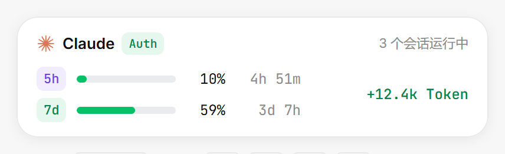
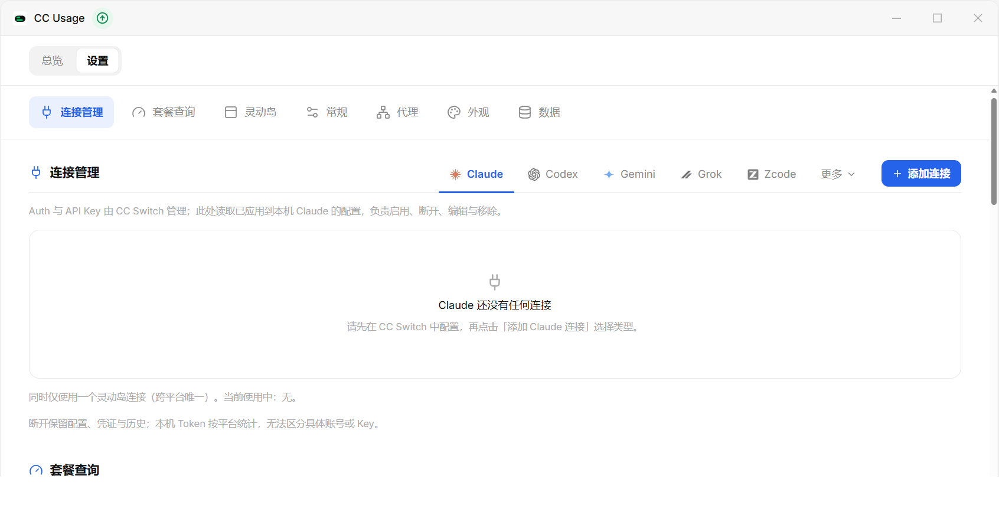
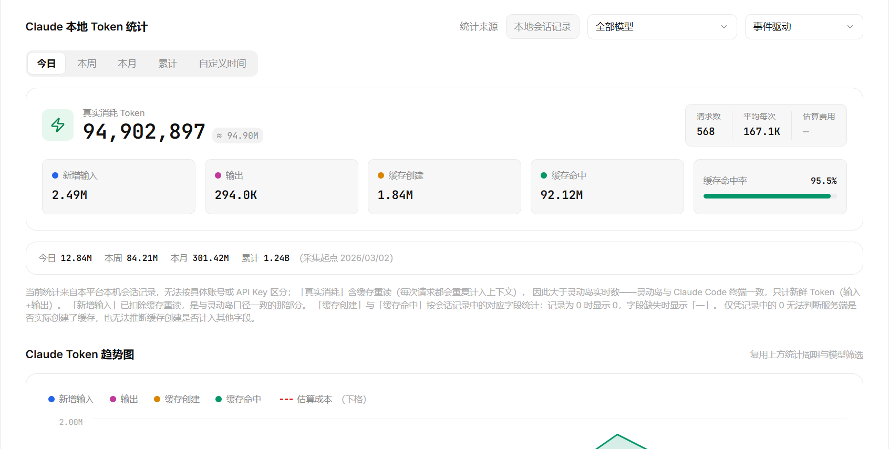
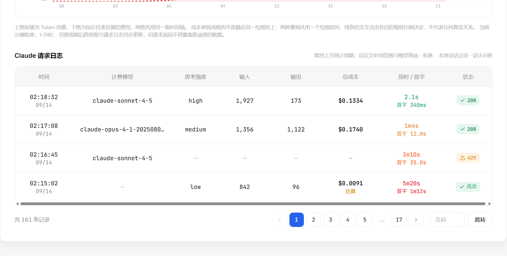
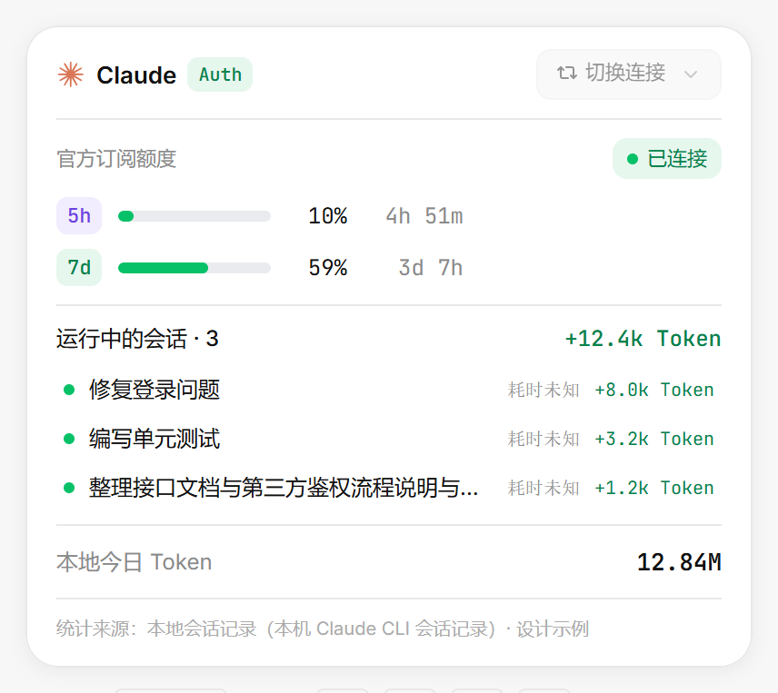
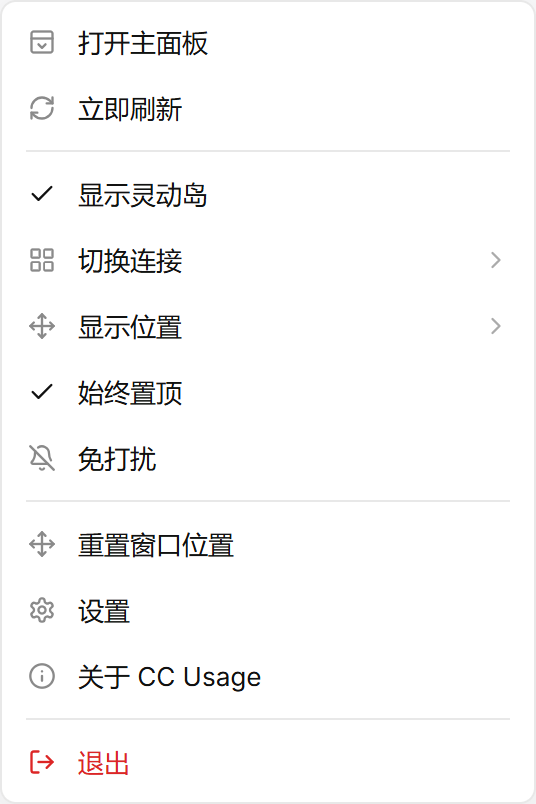

**Website: [https://haishishushu.github.io/cc-usage-website/](https://haishishushu.github.io/cc-usage-website/)**

<div align="center">

# CC Usage

**AI usage, at a glance.**

A desktop island and full dashboard for local AI coding usage and provider quotas.

[](https://github.com/haishishushu/cc-usage/releases/latest)
[](https://haishishushu.github.io/cc-usage-website/#/en/download)

[Download](https://haishishushu.github.io/cc-usage-website/#/en/download) · [Documentation](https://haishishushu.github.io/cc-usage-website/#/en/docs) · [Changelog](https://haishishushu.github.io/cc-usage-website/#/en/changelog) · [Report an issue](https://github.com/haishishushu/cc-usage/issues)

[简体中文](./README.md) | English



</div>

> Screenshots illustrate the interface and workflow. Their numbers are not your usage. Actual results depend on local records, connection permissions, and provider responses. Desktop screenshots retain the original Chinese interface.

## Contents

- [Features](#features)
- [Platform and quota support](#platform-and-quota-support)
- [Download and install](#download-and-install)
- [First run](#first-run)
- [Everyday use](#everyday-use)
- [Understanding the numbers](#understanding-the-numbers)
- [Updates and data retention](#updates-and-data-retention)
- [Privacy and local storage](#privacy-and-local-storage)
- [FAQ](#faq)
- [Development and builds](#development-and-builds)
- [Feedback and license](#feedback-and-license)
- [Community 社区](#community-社区)
- [Star History](#star-history)

## Features

| Feature | What it provides |
| --- | --- |
| Desktop island | Current connection quota, reset timers, and session activity for supported sources; double-click to expand and drag to dock |
| Dashboard | Token breakdowns, cache usage, request counts, and available cost estimates by platform, date range, and model |
| Request logs | Paginated records with model, input/output usage, costs, and available status or timing information |
| Connections | Read local authorization or API configuration; check, enable, disconnect, edit, and remove connections |
| Coding-plan quotas | Recognize supported provider URLs and display the quota windows returned by the service |
| Data management | Import/export usage records and session titles; configure history retention |
| Background operation | Tray access, remembered window placement, single-instance startup, and in-app updates |

Local usage and online quotas are independent: **local sessions do not guarantee access to account quotas, and an accessible account quota does not imply local session history exists.**

## Platform and quota support

### AI tools

| Platform | Implemented capabilities | Boundaries |
| --- | --- | --- |
| Claude | Claude Code local sessions, tokens and cost estimates, official subscription and supported gateway queries | Quotas require valid authorization; local usage is aggregated by platform |
| Codex | Codex CLI local sessions, tokens and cost estimates, official subscription and supported gateway queries | Local usage cannot be attributed separately to multiple accounts or keys on the same platform |
| Gemini | Gemini CLI local sessions and token increments | Online remaining quota is not integrated |
| Grok | SuperGrok remaining subscription percentage through local OAuth | No local session statistics; prepaid API balance needs separate management authorization |
| Zcode | Local usage records, token increments, BigModel Coding Plan key queries | Account OAuth quota is not integrated |
| Trae | Local source detection entry | No local session statistics; personal quota is unverified and enterprise quota requires administrator authorization |
| Qoder | Local records and recorded credits for domestic and international editions | Online remaining credits are not integrated; available fields depend on source records |
| Workbuddy | Local usage, cache, and reported credit consumption | Consumed credits are not remaining credits; online personal remaining credits are not integrated |

Follow the capability messages shown in the application. Windows, macOS, and Linux build targets exist, but third-party data locations and tray behavior differ between systems. An available installer does not mean every source has been verified on that OS.

### Quota providers

A platform is the tool you use; a provider supplies its quota. For example, using a Kimi coding plan through Claude still belongs to the Claude platform.

| Provider | Setup | Available quota information |
| --- | --- | --- |
| Claude / Codex official subscriptions | Read the corresponding CLI login credentials | Subscription windows and reset times returned by the server |
| Zhipu GLM / Z.ai | Detect domestic/international URL; team plans also need organization and project IDs | Plan usage windows |
| Kimi | Detect the Coding service URL | Five-hour and weekly windows |
| MiniMax | Detect domestic/international service URL | Five-hour window and weekly window when returned |
| ZenMux | Query a supported service URL | Quota windows and monetary information when provided |
| OpenCode Go | Detect the Go service URL | Rolling, weekly, and monthly windows |
| Volcano Ark | Detect the plan URL; supply query AccessKey ID and Secret AccessKey | Session, weekly, and monthly windows |
| Grok | Use the corresponding local OAuth authorization | SuperGrok remaining subscription percentage |

Actual windows depend on your plan and the service response. Unsupported, unknown, or failed queries are not equivalent to zero remaining quota.

## Download and install

Choose your OS on the [download page](https://haishishushu.github.io/cc-usage-website/#/en/download), or select a specific version in [GitHub Releases](https://github.com/haishishushu/cc-usage/releases).

| System | File to choose | Installation |
| --- | --- | --- |
| Windows 10 / 11 x64 | `Windows-x86_64-Setup.exe` | Run the installation wizard, then launch CC Usage |
| macOS Apple Silicon | `macOS-arm64.dmg` | Open the disk image and drag the application to Applications |
| macOS Intel | `macOS-x86_64.dmg` | Open the disk image and drag the application to Applications |
| Linux x64 | `Linux-x86_64.AppImage` | Allow execution in file properties, then launch |
| Debian / Ubuntu family, x64 | `Linux-x86_64.deb` | Install with your system's package installer |

- On macOS, check About This Mac to identify the processor.
- `.sig` files are update signatures; `latest.json` is update metadata. Neither is a manual installer.
- Each version has a separate release page. Download historical packages from that version's page.
- If your system cannot run a package, check its architecture, source, and release notes. Linux also requires the appropriate desktop runtime dependencies.

## First run

### 1. Launch the application

On first installation, the main panel opens centered on screen. The island appears at the top center for about five seconds, then docks to the upper edge if docking remains enabled and the introduction has not been interrupted by actions such as manually expanding it.

Later launches restore saved display preferences and window placement. Repeated shortcut clicks activate the existing instance instead of starting multiple applications.

### 2. Prepare a data source

Log in to or configure the AI tool you want to monitor and create a real session. CC Usage reads existing local records; it does not invent usage history.

- **Official subscription:** log in with the corresponding CLI, then read its local authorization.
- **Local API configuration:** configure and apply it to the platform in CC Switch, then let CC Usage read the key and service URL.
- **Local source monitoring:** run the source application and create records, then detect the source. This does not switch accounts in the external application.
- **Manual API connection:** enter a service URL and key only when the selected platform exposes that option; follow the dialog's capability notes.

### 3. Add and check a connection

1. Open **Settings → Connection management** (`设置 → 连接管理`).
2. Choose the platform, add a connection, and select an available connection type.
3. Read local configuration or enter the information permitted by the dialog.
4. Use **Check** (`检测`) on the connection row and inspect its status or error message.
5. If your plan requires extra query credentials, fill in the corresponding settings and check again.



A successful check means the connection or source is accessible. Token, quota, and balance support still follow the capability table above.

### 4. Select the island connection

Expand the island and select the connection to display using its connection switcher. The selection is saved locally and read again after a restart or normal in-place update.

If that connection was deleted, disconnected, or its credentials expired, restore it or choose another. The application does not silently substitute another account on the same platform.

### 5. Confirm collection works

Complete another request in the AI tool, select that platform in the dashboard, and inspect today's statistics and request logs. If nothing appears, check the time filter, source location, and whether the source has written its records. See the [FAQ](#faq).

## Everyday use

### Dashboard: totals to individual requests

1. Select the platform at the top.
2. Choose today, this week, this month, all time, or a custom range; filter by model if needed.
3. Review token and cache breakdowns, then locate activity peaks in the trend chart.
4. Inspect individual records in the request log, using pagination and page navigation.





Request duration, time to first token, and status codes are shown only when available from the source. A missing field does not mean the request failed.

### Island: your selected connection at a glance

| Collapsed | Expanded |
| --- | --- |
|  |  |
| Key quota and activity information | Connection details, sessions, and supported local increments |

- **Double-click** to expand or collapse.
- **Drag toward a screen edge** to dock when docking is enabled.
- Adjust opacity, island size, docked-bar size, refresh interval, and always-on-top preferences in Settings.
- Do Not Disturb reduces notifications and motion without stopping collection.
- Restore a hidden island from the main panel or tray menu.
- **Right-click** the island for its menu: switch connection, position, always on top, and **Open clone / Close clone**. Each clone picks its own connection, docks and moves independently, and is restored after a restart. At least one island always remains; the number in the menu's top-right corner is the current island count.

### Tray and windows



- Left-click the tray icon to open the main panel; right-click for the menu.
- Closing the main panel leaves collection and the island running. Use the exit action to quit completely.
- Reopening the panel restores its saved size and position. After changing monitors, use the reset-position action if a window is off-screen.

## Understanding the numbers

| Metric | Meaning and limitations |
| --- | --- |
| Local tokens | Local session usage aggregated by platform, not an individual account or key's bill |
| New input | Input excluding identifiable cache rereads |
| Cache reads / writes | Reuse of existing cache and creation of cache; source field availability varies |
| Island increment | Fresh-token increments from supported sources; a different measure from totals including cache rereads |
| Subscription quota | Account or plan windows reported by the service, potentially including activity on other devices |
| Estimated cost | An estimate based on recognized models and prices, not a final invoice or subscription debit |
| Credits | Reported consumed credits; not remaining account credits unless explicitly identified as such |
| `—` / unsupported / query failed | Distinct states; do not interpret all of them as zero |

Local tokens, island increments, and official quota do not have to match. Other devices, missing history, cache semantics, and provider refresh delays can all produce differences.

## Updates and data retention

1. Check for updates in the application and download the new version.
2. After download and verification finish, install it and follow the restart prompts.
3. Check your island connection and dashboard data after reopening.

Settings and statistics live in the application data directory. Normal in-place updates reuse that directory, including the selected island connection, display preferences, and main-panel placement. Deleting user data, switching OS accounts, or removing data during uninstallation is different from an in-place update.

**Statistics export is not a full application backup:**

- **Import / Export** (`导入 / 导出`) covers usage records and session titles, with deduplication on import. It excludes connections and credentials.
- To back up the complete local state, open the data directory from Settings, fully exit through the tray, then copy the entire directory.
- The complete directory may contain credentials; keep it in a trusted location. Restoring to another device may still require signing in again with the original tools.

See the [versioning rules](./docs/release-versioning.md) for release numbering. Each version's installers belong to its own GitHub Release.

## Privacy and local storage

```text
Local sessions ── incremental read / deduplication ──> SQLite ──> Dashboard / Island
Provider APIs  ── authorized quota queries ────────────────────> Quota windows
Update service ── version checks / package downloads ─────────> App updates
```

- Statistics are stored locally in `usage.db`; runtime preferences are stored in `settings.json`.
- Open the data directory from the data section in Settings to find its actual location. On Windows, the default application directory is normally `%APPDATA%\dev.ningz.cc-usage`.
- Quota checks, credential refresh, and model queries contact their respective services and send authorization as required. Local storage does not mean the application never uses the network.
- Update checks access the configured GitHub Pages / GitHub endpoints.
- Default session collection reads original local records. If you explicitly enable the local proxy, model requests pass through it to the configured upstream, and related CLI configuration may change.
- Manual API keys are stored locally and masked in lists. Do not publish the full data directory or credential files.

## FAQ

<details>
<summary>Why are there no statistics after installation?</summary>

Make sure the source tool has generated local sessions, select the correct platform and date range, and check source readability. An online account alone does not supply cross-device history. Platforms without local session support, such as Trae, cannot show complete token statistics.

</details>

<details>
<summary>Why do tokens appear but subscription quota does not?</summary>

Local statistics and online quotas are independent. Check platform support, authorization, provider URL recognition, and required plan credentials. A working API key does not necessarily grant subscription-quota access.

</details>

<details>
<summary>Why do local tokens stay the same when I switch accounts?</summary>

Local records are aggregated by platform and shared between its connections. They cannot currently be assigned separately to each account or key. Online quota is queried using the selected connection's authorization.

</details>

<details>
<summary>How do I find a hidden island or main panel?</summary>

Open the panel from the tray and confirm the island is enabled. Use the reset-position action after monitor or resolution changes. On Windows, the tray icon may be in the hidden-icons area.

</details>

<details>
<summary>What if the previous connection is unavailable after updating?</summary>

Wait for initialization, then check that connection. A saved selection does not make credentials permanent: renew expired login through the source CLI or application. If the data directory was removed or the OS user changed, reconnect or restore a backup.

</details>

<details>
<summary>What if an update check or download fails?</summary>

Check access to GitHub and update endpoints, including your network proxy. You can also download the correct installer from the version's release page and perform an in-place installation while retaining the application data directory.

</details>

<details>
<summary>Why does browser preview differ from the desktop application?</summary>

Browser preview uses example data and does not read real desktop credentials or usage. Run the desktop application to inspect actual local usage.

</details>

## Development and builds

Stack: **Tauri 2 · Rust · React 19 · TypeScript · Vite · Tailwind CSS 4 · SQLite**.

### Environment and commands

The release workflow uses Node.js 22, pnpm 10, and Rust stable. Desktop builds also need the target OS's Tauri build prerequisites. See the [release workflow](./.github/workflows/release.yml) for Linux packages and platform bundle arguments.

Run from the repository root:

```bash
pnpm install
pnpm --dir frontend install

# Browser UI preview with example data
pnpm dev

# Desktop development with the Rust backend and local data
pnpm tauri dev

# Frontend type check and production build
pnpm build

# Desktop packaging; the default configuration targets Windows NSIS
pnpm tauri build
```

For macOS and Linux, select the appropriate bundle target as shown in the release workflow. Artifacts are under the relevant `release/bundle/` directory within `backend/target/`; not every platform uses `nsis/`.

The initial Rust compilation can take time; inspect terminal output for progress. If the Tauri CLI is missing, install root dependencies first. When changing development ports, keep the Vite URL and Tauri `devUrl` aligned.

### Repository structure

```text
cc-usage/
├─ frontend/          React windows and browser example data
│  └─ src/
│     ├─ views/       Dashboard, island, settings, and tray views
│     ├─ components/  Feature and shared components
│     └─ lib/         API bridge, platform catalog, settings and data hooks
├─ backend/           Rust / Tauri backend
│  └─ src/            Collection, storage, connections, quotas, windows, updates
├─ docs/              Screenshots, versioning rules, verification notes
├─ scripts/           Release checks, version calculation, acceptance scripts
└─ .github/workflows/ Cross-platform builds and releases
```

Collectors read records incrementally and deduplicate them into SQLite. Quota modules query the selected connection's service. Windows and tray share persisted settings. Capability definitions are in the [platform catalog](./frontend/src/lib/platformCatalog.json).

## Feedback and license

- [Report an issue or suggestion](https://github.com/haishishushu/cc-usage/issues): include the version, OS, reproduction steps, and expected/actual results. Redact credentials from screenshots and logs.
- [Documentation](https://haishishushu.github.io/cc-usage-website/#/en/docs) · [Releases](https://github.com/haishishushu/cc-usage/releases) · [Roadmap](./todo.md)
- The previous project description specifies MIT; a standalone LICENSE file has not yet been added. Contributions with a clear problem statement and verification notes are welcome.

## Community 社区

[linux.do](https://linux.do/) - A thriving developer community.

## Star History

<a href="https://www.star-history.com/?repos=haishishushu%2Fcc-usage&amp;type=date&amp;legend=top-left">
  <picture>
    <source media="(prefers-color-scheme: dark)" srcset="https://api.star-history.com/chart?repos=haishishushu/cc-usage&amp;type=date&amp;legend=top-left&amp;theme=dark" />
    <source media="(prefers-color-scheme: light)" srcset="https://api.star-history.com/chart?repos=haishishushu/cc-usage&amp;type=date&amp;legend=top-left" />
    
  </picture>
</a>
