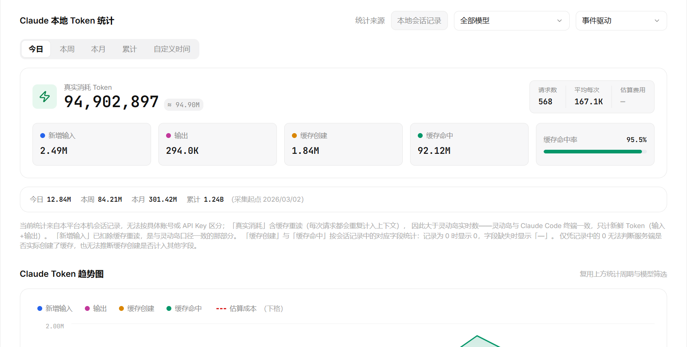
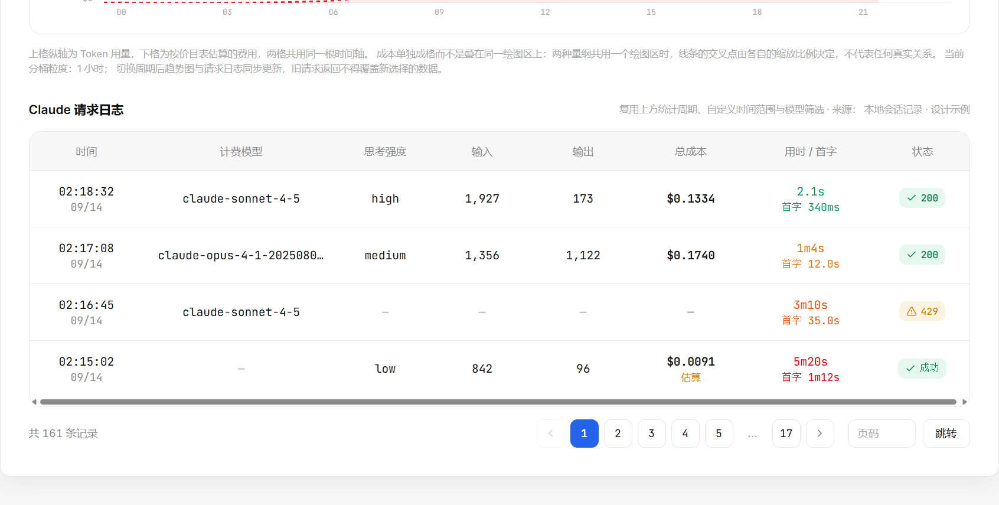
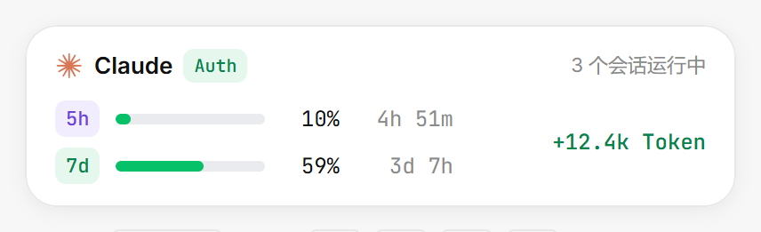
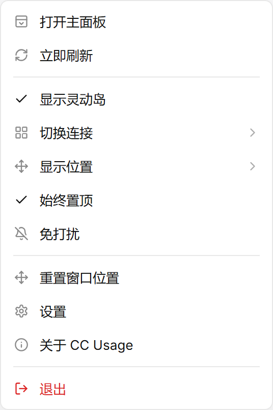
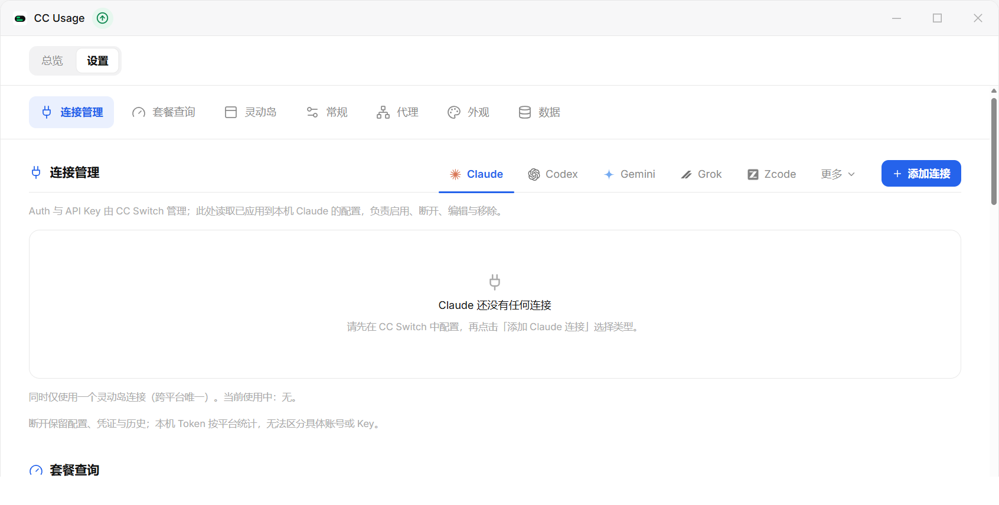

<div align="center">

# CC Usage

**常驻灵动岛的 AI 用量监控桌面应用**

统一查看 Claude、Codex 等 AI 编程工具的订阅额度、Token 用量与请求日志。
数据全部来自本机会话记录，不上传、不外发。

[下载安装](https://haishishushu.github.io/cc-usage-website/#/download) · [使用指南](#使用指南) · [项目架构](#项目架构) · [开发者指南](#开发者指南)


</div>

## 这个项目是干嘛的

CC Usage 是一款 Windows 桌面应用：屏幕顶部常驻一枚「灵动岛」，随时显示订阅额度水位和今日 Token 增量；
需要细看时打开主面板，有完整的统计、趋势图和逐条请求日志。

核心能力：

- **灵动岛常驻** —— 额度水位、会话状态、今日增量一目了然；双击展开看细节，拖到屏幕四边自动吸附
- **主面板统计** —— 今日 / 本周 / 本月 / 累计 Token，新增输入、输出、缓存创建、缓存命中率、请求数与估算费用
- **本地会话采集** —— 增量读取 Claude Code 与 Codex CLI 的本机会话记录，按 `message.id` / `response_id` 去重，不漏记不重记
- **订阅额度查询** —— 5 小时 / 7 天窗口水位与重置倒计时直连查询；编程套餐（智谱 GLM、Kimi、MiniMax、ZenMux、OpenCode Go、火山方舟、Grok 等）按连接地址自动识别
- **请求日志** —— 每条请求的模型、思考强度、输入 / 输出、成本、用时 / 首字与状态码，支持分页与筛选
- **托盘常驻** —— 关闭主面板只是隐藏，程序在托盘继续工作


## 下载安装

1. 前往[官网下载页](https://haishishushu.github.io/cc-usage-website/#/download)获取最新安装包（Windows 安装向导）
2. 双击安装包，按中文向导提示完成安装
3. 启动后：
   - 系统托盘出现 CC Usage 图标
   - 屏幕顶部出现灵动岛
   - 主面板可在托盘菜单中随时打开

系统要求：Windows 10 / 11。

## 使用指南

### 主面板

从托盘菜单选择「打开主面板」，或在灵动岛展开态点击右上角入口。关闭主面板只是隐藏窗口，不影响后台采集。


- **顶部平台栏**：在 Claude / Codex / Gemini / Grok / Zcode / Trae / Qoder / Workbuddy 之间切换，各自独立统计与连接
- **订阅额度**：官方订阅显示 5 小时 / 7 天窗口的已用比例与重置倒计时
- **连接栏**：选择当前连接或添加新连接（见下文「连接与套餐额度」）



- **本地 Token 统计**：按 今日 / 本周 / 本月 / 累计 / 自定义时间 查看；可按模型筛选
- **统计口径**：「真实消耗」含缓存重读，与灵动岛增量（只计新鲜 Token）口径不同；「新增输入」已扣除缓存重读，是与灵动岛一致的那部分



- **趋势图**：上格 Token 用量、下格按价目表估算的费用，两格共用同一根时间轴
- **请求日志**：时间、计费模型、思考强度、输入 / 输出、总成本、用时 / 首字、状态码，支持分页与跳转

### 灵动岛

收缩态常驻屏幕，显示当前连接的额度水位与会话状态；**双击展开**查看运行中的会话、今日 Token 与切换连接。



- 按住拖动到屏幕任意一边，松手自动吸附
- 托盘菜单或岛内菜单可临时隐藏；显示位置、置顶、免打扰均可在托盘菜单调整

### 系统托盘

- **左键单击**托盘图标：显示 / 隐藏灵动岛
- **右键**：打开菜单



### 连接与套餐额度

在 **设置 → 连接管理** 中管理各平台的连接。Auth 与 API Key 由 [CC Switch](https://github.com/farion1231/cc-switch) 统一管理，CC Usage 读取已应用到本机的配置，负责启用、断开、编辑与移除。



- **官方账号（Auth）**：使用本机 CLI 登录凭证，支持凭证发现、刷新与验证
- **API Key**：个人 API 连接，按用量与费用统计
- **编程套餐**：智谱个人版、Kimi、MiniMax、ZenMux、OpenCode Go 按连接的服务地址自动识别，无需配置；智谱团队版需填写组织 / 项目 ID，火山方舟需填写 AccessKey

## 项目架构

技术栈：**Tauri 2 + Rust + React 19 + TypeScript + Vite + Tailwind CSS 4 + shadcn/ui + SQLite**

```
cc-usage/
├─ frontend/        React 前端（多窗口界面）
├─ backend/         Tauri + Rust（窗口、托盘、采集、存储与查询）
│  └─ src/          Rust 模块（见下表）
├─ scripts/         安装器美术源文件与图标脚本
├─ prd/             设计画布与 UI 需求文档
├─ docs/            验证记录与 README 配图
└─ todo.md          实现清单与路线图
```

依赖分三处管理：`frontend/package.json`（前端依赖）、根目录 `package.json`（Tauri CLI 与统一脚本）、`backend/Cargo.toml`（Rust 依赖）。

### 前端结构

```
frontend/src/
├─ views/       每种窗口一个入口：主面板、灵动岛、托盘摘要、自绘菜单等
├─ components/  按域分组：island / panel / settings / tray / brand / ui
├─ lib/         Tauri API 桥接、设置与显示偏好 hooks
├─ mock/        浏览器预览（Showcase）用示例数据
└─ types.ts
```

窗口复用同一份前端：Tauri 用 URL 查询参数区分窗口（`?window=island`、`?window=menu` 等，默认主面板），
浏览器直开则是带示例数据的预览模式。

### 后端模块

| 职责 | 模块 |
|---|---|
| 会话采集 | `collector` · `watcher` · `native_parse` · `native_sources` · `session_titles` · `session_presence` |
| 本地存储 | `db` · `source_store` |
| 额度与计费 | `quota` · `coding_plan` · `grok_quota` · `platforms` · `provider_key` · `pricing` · `effort_map` |
| 连接与凭证 | `connections` · `creds` · `cli_apply` |
| 系统集成 | `tray_icon` · `tray_summary` · `dock` · `context_menu` · `startup` · `updater` |
| 网络与配置 | `proxy` · `proxy_config` · `settings` · `data_files` · `validation` |

### 数据流

```
~/.claude/projects    增量读取 · 去重                     只读查询（Tauri command）
~/.codex/sessions ─────────────────▶ SQLite 本地库 ◀──────────────────── 主面板 / 灵动岛 / 托盘
                                                              ▲
              各平台额度接口（按连接 base_url 自动识别）──────────┘
                                5h / 周 / 月窗口直连查询
```

- **本地统计链路**：`watcher` 监听会话文件变化，`collector` 增量解析并按 `message.id` / `response_id` 去重后写入 SQLite；前端只读查询，不打扰原始记录
- **额度查询链路**：按当前连接的 `base_url` 识别服务商，直连其额度接口查询窗口水位，与本地统计互不混淆

## 常见问题

**安装后托盘找不到图标？**
在开始菜单重新启动 CC Usage；若被任务栏折叠，请在任务栏设置中将其设为常显。

**灵动岛不见了？**
右键托盘图标，确认「显示灵动岛」已勾选；也可以用「重置窗口位置」把它拉回屏幕内。

**`'tauri' 不是内部或外部命令`**
尚未安装根目录中的 Tauri CLI。先在仓库根目录跑一次 `pnpm install`。

**首次 `pnpm tauri dev` 卡很久**
正常。Rust 在编译几百个依赖，只有第一次慢。

## 开发者指南

```bash
# 前置：Node.js 18+、pnpm、Rust 工具链（https://rustup.rs）

pnpm install                  # 仓库根目录，安装 Tauri CLI
pnpm --dir frontend install   # 安装前端依赖

pnpm tauri dev                # 启动桌面端（首次编译 Rust 需 3–10 分钟）
pnpm tauri build              # 打包安装程序，产物在 backend/target/release/bundle/nsis/
pnpm dev                      # 只看界面：浏览器打开 http://localhost:5173（示例数据）
```

> 环境常见问题（Rust 未装、端口被占等）见上方「常见问题」。

## 相关链接

- [官网与下载](https://haishishushu.github.io/cc-usage-website/#/download)
- [实现清单与路线图](./todo.md)
- 设计画布：[`prd/pencil-new.pen`](./prd/pencil-new.pen)
